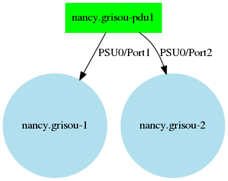
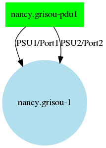
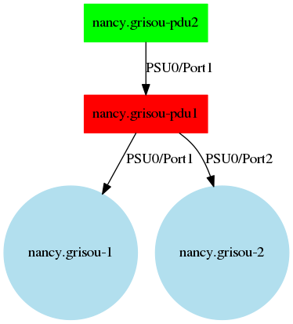
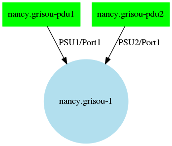
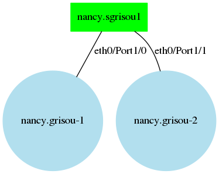
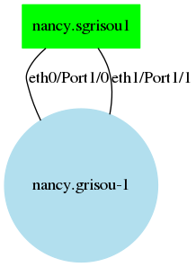
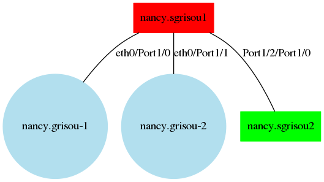
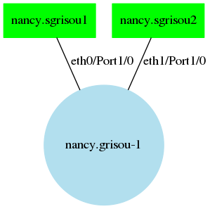
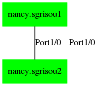

..
      Copyright 2017 Clément Parisot (Inria)

      Licensed under the Apache License, Version 2.0 (the "License"); you may
      not use this file except in compliance with the License. You may obtain
      a copy of the License at

          http://www.apache.org/licenses/LICENSE-2.0

      Unless required by applicable law or agreed to in writing, software
      distributed under the License is distributed on an "AS IS" BASIS, WITHOUT
      WARRANTIES OR CONDITIONS OF ANY KIND, either express or implied. See the
      License for the specific language governing permissions and limitations
      under the License.

========
Exemples
========

Power configuration examples
============================

Here you can find multiple examples of driver configuration for Kwapi

1 PDU 2 nodes
-------------

2 nodes connected to 1 PDU.

.. literalinclude:: ../graphs/1pdu2nodes.conf
  :caption: drivers.conf

1 PDU, 1 node, multiple PSU
---------------------------

1 Node with 2 PSU (Power Supply Unit) connected to 1 PDU.

.. literalinclude:: ../graphs/1pdu1node_multi.conf
  :caption: drivers.conf

1 PDU, shared measure, 2 nodes 
------------------------------

2 nodes connected to a non-monitorable PDU. The non-monitorable PDU in red is connected to a monitorable PDU.
It is equivalent to a shared consumption measure for the 2 nodes.

.. literalinclude:: ../graphs/1pdu2nodes_shared.conf
  :caption: drivers.conf

2 PDU, 1 node, 2 PSU 
--------------------

1 node with 2 PSU connected to 2 different PDU.

.. literalinclude:: ../graphs/2pdu1node_multi.conf
  :caption: drivers.conf

Network configuration examples
==============================

1 Switch 2 nodes
----------------

2 nodes connected to 1 switch.

.. literalinclude:: ../graphs/1switch2nodes.conf
  :caption: drivers.conf

1 Switch, 1 node, multiple network interfaces
---------------------------------------------

1 Node with 2 network interfaces (eth0 and eth1) connected to 1 switch.

.. literalinclude:: ../graphs/1switch1node_multi.conf
  :caption: drivers.conf

1 switch, shared measure, 2 nodes 
---------------------------------

2 nodes connected to a non-monitorable switch. The non-monitorable switch in red is connected to a monitorable switch in green.
It is equivalent to a shared bandwitch measure for the 2 nodes.

.. literalinclude:: ../graphs/1switch2nodes_shared.conf
  :caption: drivers.conf

2 switches, 1 node, 2 network interfaces 
----------------------------------------

1 node with 2 network interfaces connected to 2 different switches.

.. literalinclude:: ../graphs/2switch1node_multi.conf
  :caption: drivers.conf

2 switches interlink
--------------------

2 switches are connected to each other.

.. literalinclude:: ../graphs/2switchs.conf
  :caption: drivers.conf

